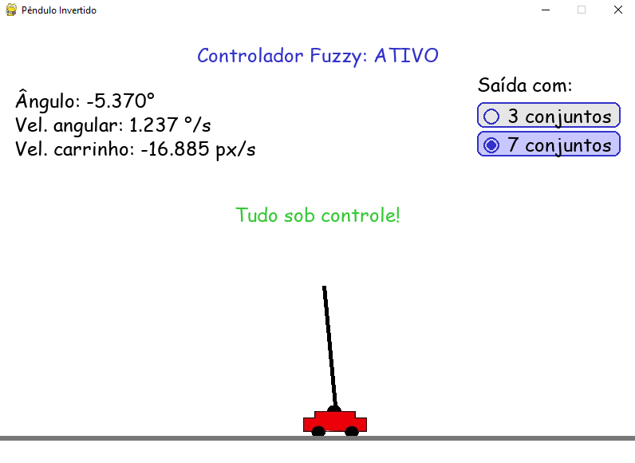

# Simulador de Pêndulo Invertido com Controle Fuzzy

## Descrição

Este projeto é uma simulação interativa de um pêndulo invertido controlado por um sistema fuzzy, desenvolvida em Python com a biblioteca Pygame. O objetivo é manter o pêndulo equilibrado sobre um carrinho, utilizando tanto o controle manual (setas do teclado) quanto o controle automático fuzzy.

---

## Funcionalidades

- **Controle Manual:** Use as setas do teclado para mover o carrinho para a esquerda ou direita.
- **Controle Fuzzy:** Ative o controlador fuzzy para que o sistema tente equilibrar o pêndulo automaticamente.
- **Seleção de conjuntos fuzzy:** Escolha entre 3 ou 7 conjuntos fuzzy para a saída do controlador, alterando a precisão e o comportamento do controle.
- **Leituras em tempo real:** Exibe na tela o ângulo do pêndulo (em graus), velocidade angular (em graus/segundo) e velocidade do carrinho (em pixels/frame).
- **Interface gráfica amigável:** Inclui botões de menu, ajuda, créditos e seleção de conjuntos fuzzy.
- **Sons:** Música de fundo e efeito sonoro de game over.
- **Tela de ajuda:** Explica o objetivo e os controles do jogo.
- **Tela de créditos:** Mostra os responsáveis pelo desenvolvimento do projeto.

---

## Funcionamento do Controle Fuzzy

### Entradas (Antecedente)
O controlador fuzzy recebe como entradas:
- **Ângulo do pêndulo** (em graus), que é dividido em 3 conjuntos fuzzy: Negativo, Zero e Positivo.

- **Velocidade angular do pêndulo** (em graus/segundo), que também é dividida em 3 conjuntos fuzzy: Negativo, Zero e Positivo. 

### Saída (Consequente)
A saída do sistema fuzzy é a **velocidade sugerida para o carrinho**(em pixels/segundo), que é somada ao controle manual (se ativo).

Você pode escolher entre dois modos para a saída fuzzy:
- **3 conjuntos:** Esquerda, Zero, Direita.

- **7 conjuntos:** Muito Esquerda, Esquerda, Pouco Esquerda, Zero, Pouco Direita, Direita, Muito Direita.

### Base de Regras Fuzzy
- **Para saída com 3 conjuntos fuzzy:**

    1. **Se** o ângulo for **negativo** **e** a velocidade angular for **negativa**, **então** a velocidade do carrinho deve ser para a **esquerda**.

    2. **Se** o ângulo for **negativo** **e** a velocidade angular for **zero**, **então** a velocidade do carrinho deve ser para a **esquerda**.

    3. **Se** o ângulo for **negativo** **e** a velocidade angular for **positiva**, **então** a velocidade do carrinho deve ser **zero**.

    4. **Se** o ângulo for **zero** **e** a velocidade angular for **negativa**, **então** a velocidade do carrinho deve ser para a **esquerda**.

    5. **Se** o ângulo for **zero** **e** a velocidade angular for **zero**, **então** a velocidade do carrinho deve ser **zero**.

    6. **Se** o ângulo for **zero** **e** a velocidade angular for **positiva**, **então** a velocidade do carrinho deve ser para a **direita**.

    7. **Se** o ângulo for **positivo** **e** a velocidade angular for **negativa**, **então** a velocidade do carrinho deve ser **zero**.

    8. **Se** o ângulo for **positivo** **e** a velocidade angular for **zero**, **então** a velocidade do carrinho deve ser para a **direita**.

    9. **Se** o ângulo for **positivo** **e** a velocidade angular for **positiva**, **então** a velocidade do carrinho deve ser para a **direita**.

- **Para saída com 7 conjuntos fuzzy:**

    1. **Se** o ângulo for **negativo** **e** a velocidade angular for **negativa**, **então** a velocidade do carrinho deve ser **muito para a esquerda**.

    2. **Se** o ângulo for **negativo** **e** a velocidade angular for **zero**, **então** a velocidade do carrinho deve ser **para a esquerda**.

    3. **Se** o ângulo for **negativo** **e** a velocidade angular for **positiva**, **então** a velocidade do carrinho deve ser **zero**.

    4. **Se** o ângulo for **zero** **e** a velocidade angular for **negativa**, **então** a velocidade do carrinho deve ser **pouco para a esquerda**.

    5. **Se** o ângulo for **zero** **e** a velocidade angular for **zero**, **então** a velocidade do carrinho deve ser **zero**.

    6. **Se** o ângulo for **zero** **e** a velocidade angular for **positiva**, **então** a velocidade do carrinho deve ser **pouco para a direita**.

    7. **Se** o ângulo for **positivo** **e** a velocidade angular for **negativa**, **então** a velocidade do carrinho deve ser **zero**.

    8. **Se** o ângulo for **positivo** **e** a velocidade angular for **zero**, **então** a velocidade do carrinho deve ser **para a direita**.

    9. **Se** o ângulo for **positivo** **e** a velocidade angular for **positiva**, **então** a velocidade do carrinho deve ser **muito para a direita**.

As funções de pertinência e as regras fuzzy são ajustadas conforme a seleção.

---

## Telas do jogo

---

## Como jogar

1. **Inicie o jogo** pelo menu principal.
2. **Use as setas** para controlar o carrinho manualmente.
3. **Ative o controle fuzzy** para que o sistema tente equilibrar automaticamente.
4. **Altere o número de conjuntos fuzzy** no topo direito da tela (quando fuzzy estiver ativo).
5. O jogo termina se o pêndulo cair além do limite de inclinação (90°).
6. Pressione **R** para reiniciar após o game over ou clique em **Menu** para retornar ao menu.

---

## Créditos

Projeto desenvolvido por Rômulo Rodrigues, acadêmico em Engenharia Elétrica pelo IFMA, como parte das atividades da disciplina de Automação Inteligente, sob orientação do Prof. Dr. Ginalber L. O. Serra.

---

## Requisitos

- Python 3.8+
- pygame
- numpy
- scikit-fuzzy

---
